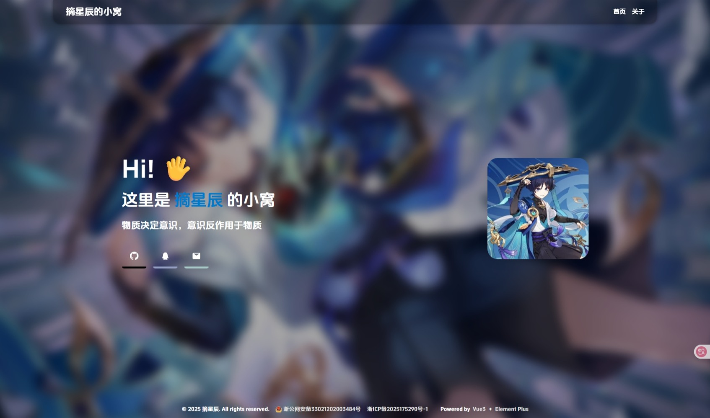

# 🌟 PickStars Blog

一个基于 **Vue 3 + TypeScript + Element Plus** 构建的个人博客网站，支持响应式设计、社交图标、打字机效果、备案信息展示等功能。


---

## Language

简体中文 | [English](./README.md)

---

## 🚀 功能特性

- 使用 Vue 3 + TypeScript + Vite 快速开发
- 图标使用 Iconfont / Font Awesome
- 社交链接图标 hover 动效
- 自定义打字机效果，支持从 API 获取一言
- 粘性页头、页脚，支持备案信息显示
- 项目构建使用 PWA 插件（可选）

---

## 🛠 技术栈

| 技术                                            | 描述                |
|-----------------------------------------------|-------------------|
| [Vue 3](https://vuejs.org/)                   | 渐进式 JavaScript 框架 |
| [TypeScript](https://www.typescriptlang.org/) | JavaScript 超集     |
| [Vite](https://vitejs.dev/)                   | 新一代前端构建工具         |
| [Element Plus](https://element-plus.org/)     | Vue 3 UI 框架       |
| [Pinia](https://pinia.vuejs.org/)             | 状态管理              |
| [Axios](https://axios-http.com/)              | 数据请求库             |
| [Sass](https://sass-lang.com/)                | 样式预处理器            |

## 📁 项目结构

```

PickstarsBlog/
├── public/ # 公共资源
│ └── assets/data/ # 本地 JSON 数据 (如社交链接)
│ └── assets/images # 图片资源
├── src/
│ ├── assets/ # 静态资源
│ ├── components/ # 通用组件（打字机、图标等）
│ ├── Views/ # 页面组件
│ ├── router/ # 路由配置
│ ├── stores/ # Pinia 状态管理
│ ├── utils/ # 工具函数
│ ├── App.vue
│ └── main.ts
├── index.html
└── vite.config.ts # Vite 配置

````

---

## 📦 安装依赖

```bash
npm install
````

---

## 🔧 本地开发

```bash
npm run dev
# 默认开启 localhost:5173，可通过 --host 局域网访问
```

---

## 📦 构建生产环境

```bash
npm run build
```

输出目录为 `/dist`。

---

## 🔍 本地预览生产环境

```bash
npm run preview
```


---

## 🌐 环境变量（可选）

你可以在根目录下添加 `.env` 文件配置如下环境变量：

```env
VITE_SITE_COPYRIGHT=PickStars
VITE_SITE_ICP=浙ICP备xxxx号
```

---

## 📄 License

[MIT](./LICENSE) © PickStars308

---

## 📬 联系我

* GitHub: [PickStars308](https://github.com/PickStars308/)
* QQ: [点我聊天](https://qm.qq.com/q/8Kg04tLXb2)
* Email: [pickstars2024@qq.com](mailto:pickstars2024@qq.com)